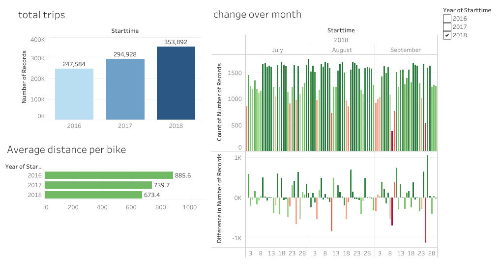
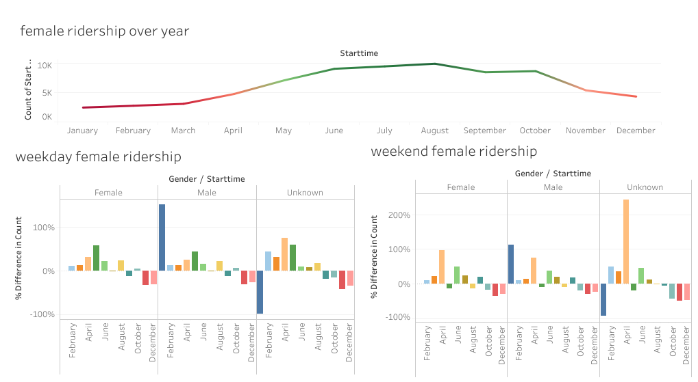
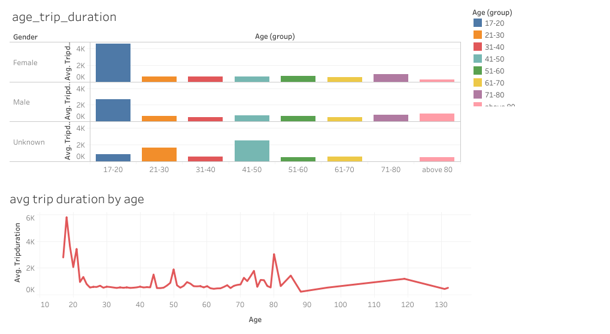
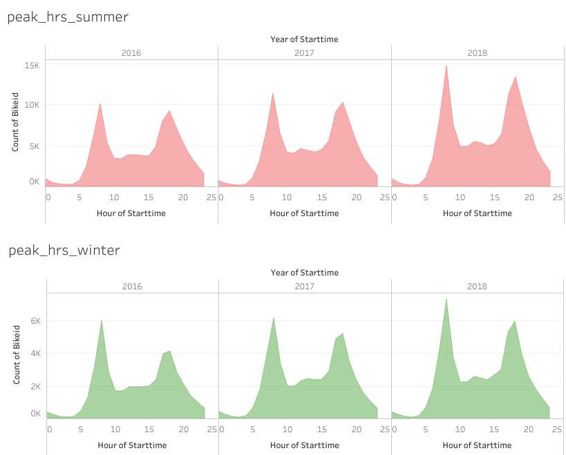
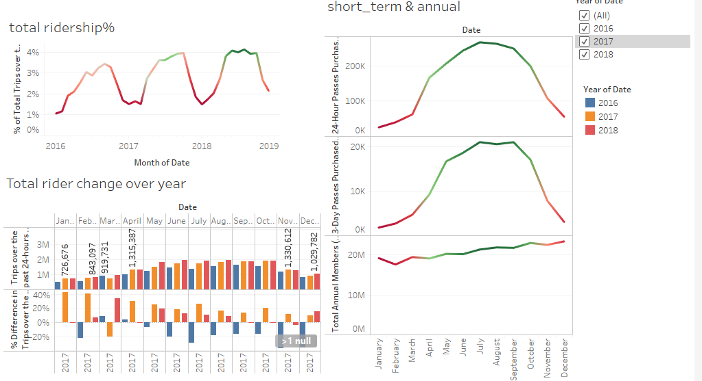

# Citi-Bike-Analytics

A analysis for the New York Citi Bike Program, in which responsible for overseeing the largest bike sharing program for 200,000+ data points in the United States in order to generate business insights in terms of visulize the peak time in both summer and winter period and the top start location in New York City and Jersey City, New Jersey.

* Click [here](https://public.tableau.com/profile/shilpi8807#!/)to view complted dashboard

#Female Ridership

## Findings

* The current major citi bike riders fall into young male group between 18 -20 but number of femal reiders increases over time as they are showing interest to start riding during the weekend

* The 1st and 2nd peak hours during a day would usually be 7-8 AM and 5-6 PM

* The total amount of annual member have been kept increased over years.

